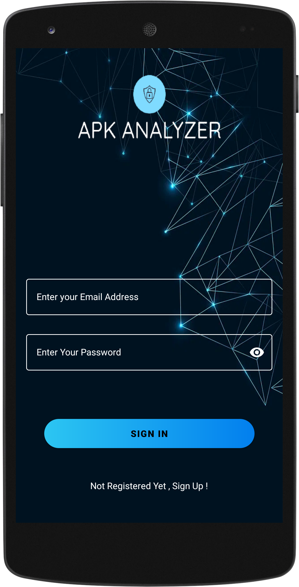
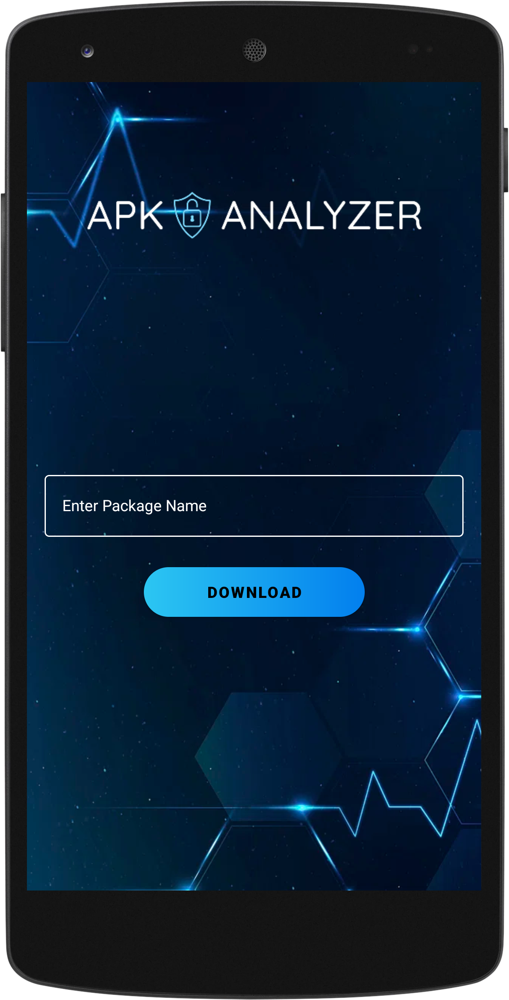
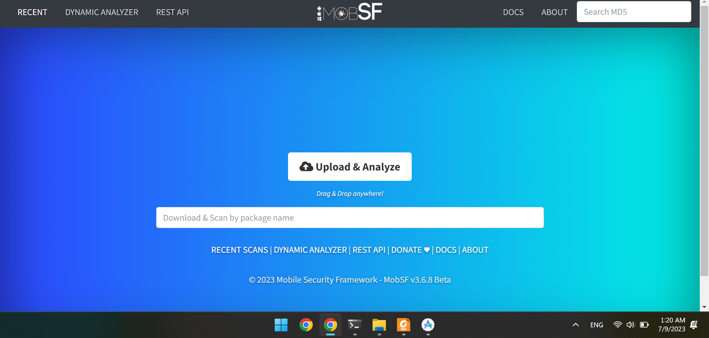
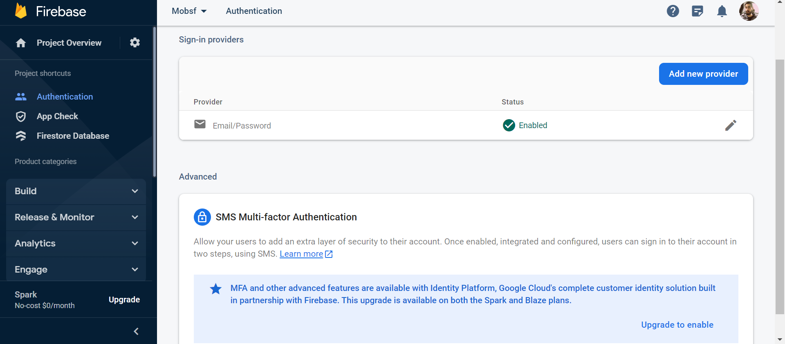

# APK Analyzer
This is an Android app written in kotlin to scan APK files for any vulnerability using Mobile Security Framework (MobSF). 
<br>
<br>
## Mobile Security Framework
Mobile Security Framework (MobSF) is an automated, all-in-one mobile application (Android/iOS/Windows) pen-testing, malware analysis and security assessment framework capable of performing static and dynamic analysis. MobSF support mobile app binaries (APK, XAPK, IPA & APPX) along with zipped source code and provides REST APIs for seamless integration with your CI/CD or DevSecOps pipeline. The Dynamic Analyzer helps you to perform runtime security assessment and interactive instrumented testing.
<br>
<br>
## Description
In this project we are going to develop a mobile security tool that will be used to download and analyze
Android application packages (APKs). The tool will be based on the Mobile
Security Framework (MobSF) and will use a Representational State Transfer (REST) API to
generate reports of the analysis.

The first step in this project is to install the necessary software, including MobSF and any
required libraries. The MobSF software will be used to perform static and dynamic analysis on
the APKs. The REST API will be used to create and store the reports on the analysis.

Once the software is installed, the tool will be configured to download APKs from evozi using web scraping methods.
This tool also parse the metadata of the APKs, including the package name, version, target SDK version, and permissions.

The tool will then be used to perform static and dynamic analysis on the downloaded
APKs. This will include decompiling the APKs, analyzing the code for any vulnerable points,
and running the APKs in an emulator to observe the behavior of the application.
Once the analysis is complete, the tool will use the REST API to generate a report of the
analysis. This report will include details such as the application’s package name, target SDK
version, permissions, and any vulnerabilities that were discovered.
<br>
<br>
## Application UI

<p float="middle">




</p>

## MobSF Installation
<h3>Easy Setup</h3>
For easy setup you just need to execute these two commands:

```bash
docker pull opensecurity/mobile-security-framework-mobsf
docker run -it --rm -p 8000:8000 opensecurity/mobile-security-framework-mobsf:latest
```
If you need Dynamic Analysis, do not setup MobSF inside Docker or Virtual Machine instead use this steps:
<br>
<br>
<h3>Requirements</h3>
First of all you need to install requirements for your appropriate operating system.<br>
check this link: https://mobsf.github.io/docs/#/requirements 

<br>
<br>
<h3>Installation steps</h3>
Please make sure that all the requirements mentioned are installed first.<br>
<br>

Linux/Mac
```bash
git clone https://github.com/MobSF/Mobile-Security-Framework-MobSF.git
cd Mobile-Security-Framework-MobSF
./setup.sh
```
Windows
```bash
git clone https://github.com/MobSF/Mobile-Security-Framework-MobSF.git
cd Mobile-Security-Framework-MobSF
setup.bat
```
<br>
<h3>Running MobSF</h3>
Linux/Mac

```bash
./run.sh 127.0.0.1:8000
```

Windows
```bash
run.bat 127.0.0.1:8000
```
<br>

<br>
<h2>Android App Structure</h2>
This application consist of 5 different activities.
LaunchScreen Activity , Sign up Activity , Sign in Activity , Main Activity , APKDownload Activity.
<br>
<h3>LaunchScreen Activity</h3>
A splash screen is displayed briefly when the app is launched then after 3 seconds the activity changes to Sign in page.<br>

```kotlin
        Handler(Looper.getMainLooper()).postDelayed({
            val intent = Intent(this, SignInActivity::class.java)
            startActivity(intent)
            finish()
        }, 3000) // 3000 is the delayed time in milliseconds.
```
<br>
<h3>Sign in Activity</h3>
This activity includes a pair of text inputs for email and password and a button to send the data to firebase database.
there is also a text under the sign in button to change the activity to sign up page.
<br>
<br>
According to this code snippet if the provided credentials by the user is accepted thus user logs in and activity changes to main activity.

```kotlin
firebaseAuth.signInWithEmailAndPassword(email, pass).addOnCompleteListener {
      if (it.isSuccessful) {
            val intent = Intent(this, MainActivity::class.java)
            startActivity(intent)
        }
```
<br>



