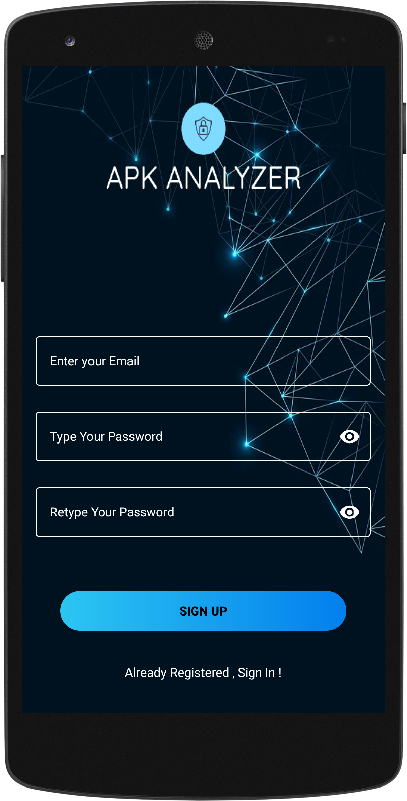

# APK Analyzer
This project is an Android app written in kotlin to scan APK files for any vulnerability using Mobile Security Framework (MobSF). 

## Mobile Security Framework
Mobile Security Framework (MobSF) is an automated, all-in-one mobile application (Android/iOS/Windows) pen-testing, malware analysis and security assessment framework capable of performing static and dynamic analysis. MobSF support mobile app binaries (APK, XAPK, IPA & APPX) along with zipped source code and provides REST APIs for seamless integration with your CI/CD or DevSecOps pipeline. The Dynamic Analyzer helps you to perform runtime security assessment and interactive instrumented testing.

## Description
In this project we are going to develop a mobile security tool that will be used to download and analyze
Android application packages (APKs). The tool will be based on the Mobile
Security Framework (MobSF) and will use a Representational State Transfer (REST) API to
generate reports of the analysis.

The first step in this project is to install the necessary software, including MobSF and any
required libraries. The MobSF software will be used to perform static and dynamic analysis on
the APKs. The REST API will be used to create and store the reports on the analysis.

Once the software is installed, the tool will be configured to download APKs from evozi using web scraping methods.
This tool also parse the metadata of the APKs, including the package name, version, target SDK version, and permissions.

The tool will then be used to perform static and dynamic analysis on the downloaded
APKs. This will include decompiling the APKs, analyzing the code for any vulnerable points,
and running the APKs in an emulator to observe the behavior of the application.
Once the analysis is complete, the tool will use the REST API to generate a report of the
analysis. This report will include details such as the application’s package name, target SDK
version, permissions, and any vulnerabilities that were discovered.
The message is usually sent to the target computer by a program executed on
device connected to the same local area network.

## Application UI

